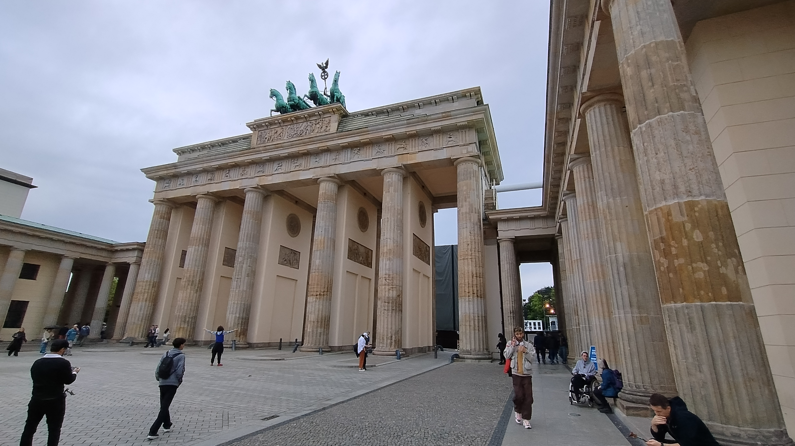
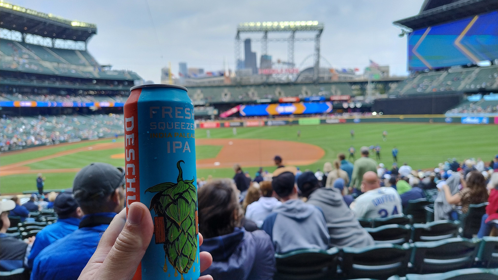
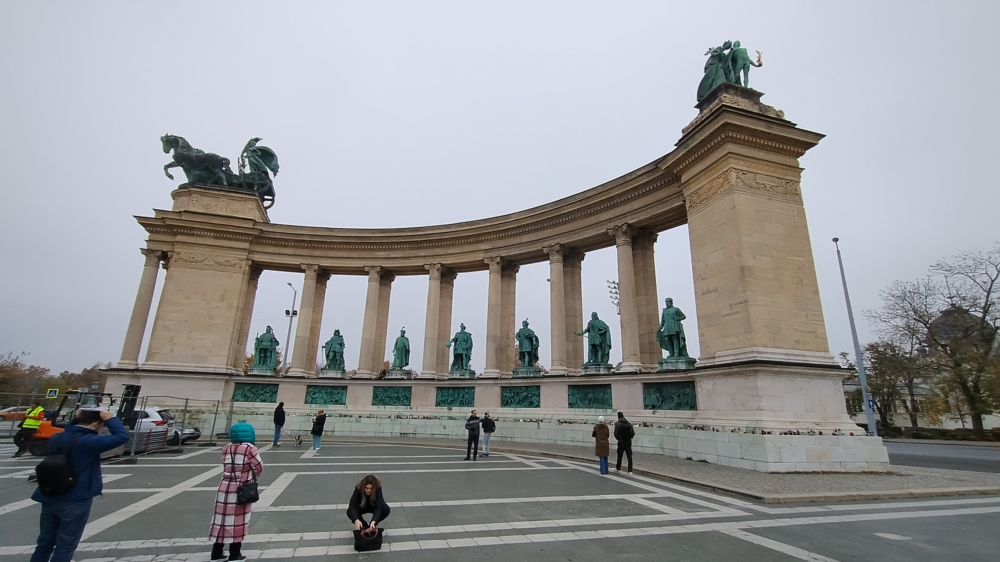

# Travel Journal 2024

## A Year of Adventures and Memories

### July 4, 2024 - Berlin, Germany
I found myself mesmerized by the iconic Brandenburg Gate in Berlin. The neoclassical architecture, crowned with a famous Quadriga, stood as a testament to elegance and history under a moody sky. As visitors gathered, the monumental structure reflected the city's resilience and rich heritage, a symbol of unity and peace.

- **Location:** Pariser Platz 8, 10117 Berlin
- [View on Map](https://www.bing.com/maps?cp=52.516416666666665~13.378411111111111&lvl=16)

---

### August 5, 2024 - Tenby, Wales
On the sandy shores near Tenby, I gazed upon a charming house set against lush greenery. The overcast sky only enhanced the serene ambiance, casting a soft light over the peaceful beach. Tracks in the sand led to a small canopy, hinting at a day filled with relaxation and gentle sea breezes.

- **Location:** 1 The Croft, Tenby, SA70 8AP
- [View on Map](https://www.bing.com/maps?cp=51.67585833333333~-4.701925&lvl=16)

---

### September 15, 2024 - Seattle, USA
Amidst the energetic atmosphere of a baseball stadium in Seattle, I enjoyed a craft IPA, its label vibrant against the field's backdrop. Fans in team colors, the excitement of the game, and the iconic skyline made for an unforgettable sporting event. The cheers and aromas of stadium snacks filled the air, adding to the lively day's experiences.

- **Location:** 1250 1st Avenue South, Seattle, WA 98134
- [View on Map](https://www.bing.com/maps?cp=47.59085~-122.33256944444445&lvl=16)

---

### November 3, 2024 - Bristol, England
In Bristol, I captured a nostalgic scene of a vibrant green steam locomotive puffing along the tracks. The railway, bordered by autumn-hinted trees, added to the vintage charm, evoking a sense of timeless adventure. The persistent hiss of steam brought the essence of historical rail travel to life.

- **Location:** 14 Batley Court, Bristol, BS30 8YZ
- [View on Map](https://www.bing.com/maps?cp=51.44443333333333~-2.466772222222222&lvl=16)

---

### November 12, 2024 - Budapest, Hungary
In Budapest, a majestic historical monument captivated my attention. Under a grand, curved colonnade, a series of imposing statues elegantly displayed their grace. The atmosphere was both solemn and vibrant, with visitors marveling at the intricate artistry. The overcast sky added gravitas, highlighting the monumental legacy and architectural prowess.

- **Location:** Budapest, Dózsa György út 94, 1068
- [View on Map](https://www.bing.com/maps?cp=47.51457777777778~19.076988888888888&lvl=16)

---

Reflecting on these journeys, each destination offered a unique adventure, filled with history, culture, and the joy of discovery. As this year unfolds, these captured moments will continue to inspire and resonate, embodying the spirit of travel and exploration.