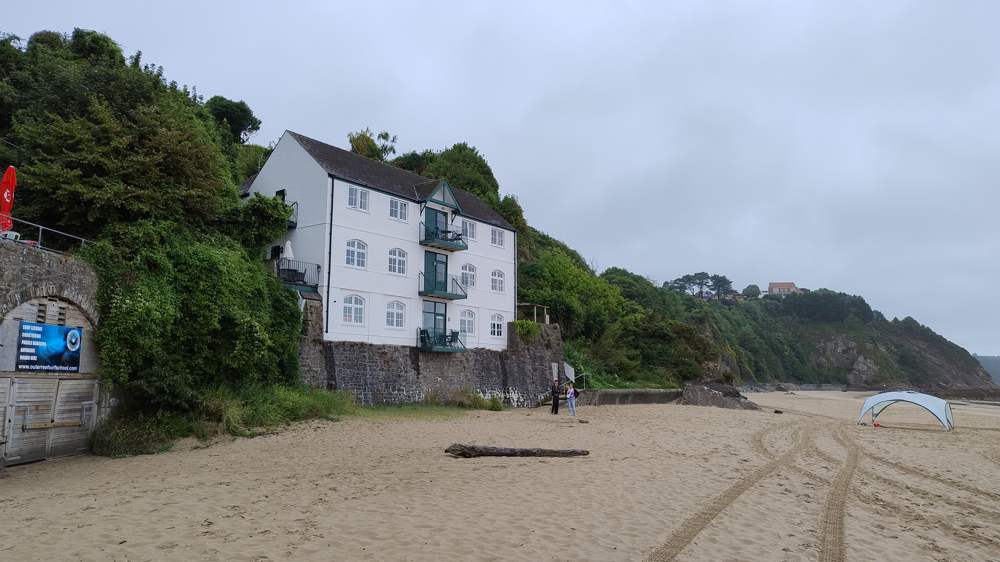

# 2024 Travel Experiences

## Wales: June 25, 2024

In June, I visited Cardiff, Wales, where I experienced an unforgettable evening at a lively concert. The atmosphere was electric as concert-goers filled the stadium, eager for the performance. The vibrant lights and visuals added to the excitement, creating a memorable experience in this bustling Welsh city.

In the vibrant city of Cardiff, a sea of enthusiastic concert-goers gathered in the stadium on June 25, 2024. [Location](https://www.bing.com/maps?cp=51.47833333333333~-3.1824749999999997&lvl=16)

## Germany: July 2-4, 2024

Traveling to Berlin, Germany, in early July, I immersed myself in the city's unique cultural experiences. My journey began with a classic culinary delight—currywurst— at a bustling street scene near Washingtonplatz. The lively environment continued outside Berlin Hauptbahnhof, a hub of modern architecture and transit. This adventure concluded at the historic Brandenburg Gate, highlighting Berlin's rich history and vibrant culture.

The vibrant city of Berlin offered an iconic currywurst experience on July 2, 2024. [Location](https://www.bing.com/maps?cp=52.52441666666667~13.369544444444445&lvl=16)

Outside Berlin Hauptbahnhof, travelers and locals intermingle on July 2, 2024. [Location](https://www.bing.com/maps?cp=52.52382222222222~13.369119444444445&lvl=16)

Admiring the iconic Brandenburg Gate in Berlin on July 4, 2024. [Location](https://www.bing.com/maps?cp=52.516416666666665~13.378411111111111&lvl=16)

## Wales: August 5, 2024

In August, I enjoyed a serene moment on the vast sandy beach of Tenby, Wales. This picturesque location, with its striking white house and deserted beach, offered a peaceful escape in a tranquil corner of the country.

A serene beach scene unfolds in Tenby, Wales, on August 5, 2024. [Location](https://www.bing.com/maps?cp=51.67585833333333~-4.701925&lvl=16)

## United States: September 15-20, 2024

September took me to Washington State, where I explored the vibrant cities of Seattle, Redmond, and Bellevue. In Seattle, I experienced the thrill of a baseball game, enjoyed a delightful downtown breakfast, and appreciated the city's unique melding of urban life and scenic beauty. Redmond offered a blend of innovative architecture and natural surroundings, while Bellevue provided a calm, modern gathering spot with a touch of nature.

Enjoying the vibrant atmosphere of a baseball stadium in Seattle on September 15, 2024. [Location](https://www.bing.com/maps?cp=47.59085~-122.33256944444445&lvl=16)

Exploring artistic structures in Redmond on September 16, 2024. [Location](https://www.bing.com/maps?cp=47.643211111111114~-122.1336888888889&lvl=16)

Capturing a serene moment outside Bellevue Brewing Company on September 18, 2024. [Location](https://www.bing.com/maps?cp=47.621375~-122.17839166666667&lvl=16)

Relishing a hearty breakfast in Seattle's downtown area on September 20, 2024. [Location](https://www.bing.com/maps?cp=47.61092777777778~-122.34072222222221&lvl=16)

## Spain: October 6, 2024

October's journey led to Spain's sunny Santanyí and Felanitx beaches, where vibrant beach scenes unfolded alongside turquoise waters and charming locales. These Mediterranean spots provided the perfect setting for leisurely days basking in the sun amidst beautiful natural surroundings.

A tranquil beach scene unfolds in Santanyí, Spain, on October 6, 2024. [Location](https://www.bing.com/maps?cp=39.376108333333335~3.2370583333333336&lvl=16)

Overlooking a lively cove in Felanitx, Spain, on October 6, 2024. [Location](https://www.bing.com/maps?cp=39.379219444444445~3.2387333333333332&lvl=16)

## United Kingdom: October 18, 2024

Returning to the UK in October, I explored the bustling city of Bristol. The vibrant cityscape, lively social spots, and nostalgic arcade scenes encapsulated the city's eclectic spirit and offered memorable experiences amidst its historical charm.

Reflecting on a lively scene in Bristol, UK, on October 18, 2024. [Location](https://www.bing.com/maps?cp=51.45366111111112~-2.592530555555556&lvl=16)

Nostalgic arcade adventures in Bristol's vibrant setting on October 18, 2024. [Location](https://www.bing.com/maps?cp=51.45308888888889~-2.5959694444444446&lvl=16)

## Hungary: November 10-12, 2024

In November, the majestic city of Budapest, Hungary, unfolded with its captivating landmarks. From a cozy bar atmosphere to the iconic sites of Fisherman's Bastion, the Danube River, and Heroes' Square, Budapest welcomed me with its timeless charm and rich historical narratives.

A cozy ambiance at a Budapest bar on November 10, 2024. [Location](https://www.bing.com/maps?cp=47.50545~19.05752777777778&lvl=16)

Exploring the majestic Fisherman's Bastion in Budapest on November 11, 2024. [Location](https://www.bing.com/maps?cp=47.50167777777778~19.034522222222225&lvl=16)

A serene scene along the Danube River, with Buda Castle in focus, on November 11, 2024. [Location](https://www.bing.com/maps?cp=47.49808055555555~19.047069444444446&lvl=16)

Standing before Hungary's Heroes' Square in Budapest on November 12, 2024. [Location](https://www.bing.com/maps?cp=47.51457777777778~19.076988888888888&lvl=16)