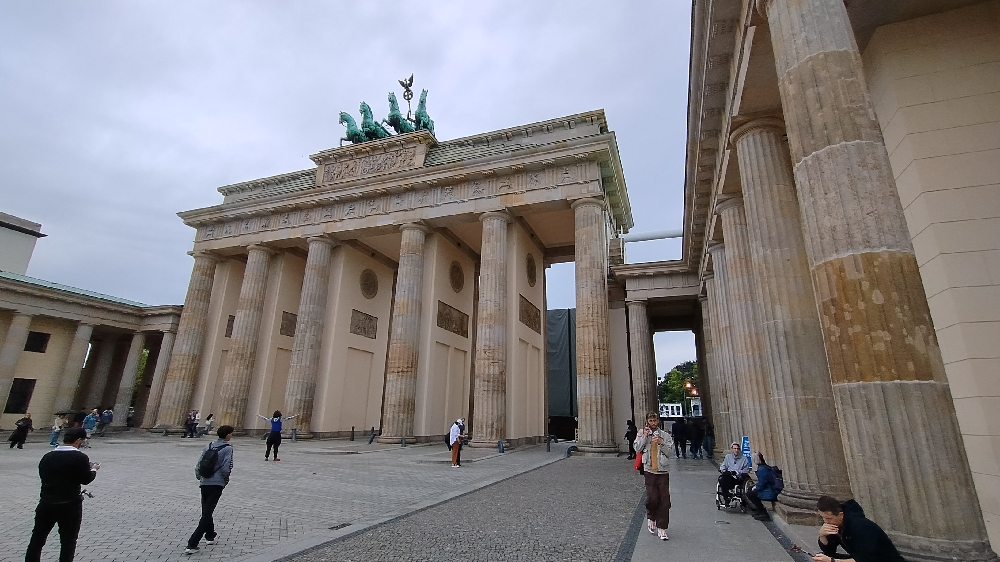

# 2024 Journeys

## United Kingdom: Cardiff (June 25, 2024)
In the summer of 2024, Cardiff was abuzz with electrifying energy as it hosted a lively outdoor concert that drew an enthusiastic crowd. The vibrant atmosphere was palpable, with colorful lights bathing the stage and the band's emblem highlighting the scale of this unforgettable event. This moment in Cardiff underscored the city's ability to bring people together for experiences filled with joy and anticipation.

  
The image captures the vibrant atmosphere of a lively outdoor concert in Cardiff on June 25, 2024. [Map Location](https://www.bing.com/maps?cp=51.47833333333333~-3.1824749999999997&lvl=16)

## Germany: Berlin (July 2 - July 4, 2024)
Berlin in early July 2024 provided a memorable blend of cultural and architectural experiences. It started with a quintessential Berlin street food moment, enjoying currywurst at Washingtonplatz. Exploring the area, the dynamic scene at Berlin Hauptbahnhof highlighted the city's modern vibe, filled with travelers weaving through its impressive glass architecture. The trip culminated at Pariser Platz, reflecting on the grandeur of Berlin's historical landmarks against an overcast sky, making it a profound exploration of Germany's capital city.
 
  
Amidst the bustling atmosphere of Berlin on July 2, 2024, a classic street food experience near Washingtonplatz. [Map Location](https://www.bing.com/maps?cp=52.52441666666667~13.369544444444445&lvl=16)

  
A bustling scene outside Berlin Hauptbahnhof on July 2, 2024, captured the city's dynamic nature. [Map Location](https://www.bing.com/maps?cp=52.52382222222222~13.369119444444445&lvl=16)

  
Reflecting on the grandeur of Berlin at Pariser Platz on July 4, 2024. [Map Location](https://www.bing.com/maps?cp=52.516416666666665~13.378411111111111&lvl=16)

## United Kingdom: Tenby (August 5, 2024)
In August 2024, a visit to Tenby offered a serene encounter with the tranquil charm of its sandy beaches. An afternoon spent there, with a picturesque white building overlooking the gentle tides, was defined by peaceful solitude. The calm and beauty of Tenby provided a restorative retreat against a lush, green backdrop, where the refreshingly cool sea breeze and the quietude of the surroundings marked a highlight of the journey.

  
A tranquil afternoon at the scenic beach of Tenby on August 5, 2024. [Map Location](https://www.bing.com/maps?cp=51.67585833333333~-4.701925&lvl=16)

## United States: Seattle and Washington (September 15 - September 20, 2024)
A September journey to Seattle and its neighboring areas in Washington state immersed travelers in vibrant urban atmospheres and natural beauty. Starting with the excitement of a baseball game against the city's skyline, to Redmond's modern architecture complementing lush greenery, each location introduced a new facet. Bellevue offered a moment of relaxation at its local brewery, while Seattle itself delivered a culinary delight through hearty breakfasts at a local eatery, completing a picturesque journey through Seattle's urban charm and natural highlights.

  
The baseball stadium in Seattle buzzes with excitement on September 15, 2024. [Map Location](https://www.bing.com/maps?cp=47.59085~-122.33256944444445&lvl=16)

  
In Redmond, modern architecture and nature blend harmoniously on September 16, 2024. [Map Location](https://www.bing.com/maps?cp=47.643211111111114~-122.1336888888889&lvl=16)

  
A vibrant scene at Bellevue Brewing Company on September 18, 2024. [Map Location](https://www.bing.com/maps?cp=47.621375~-122.17839166666667&lvl=16)

  
A delightful breakfast capturing Seattle's culinary scene on September 20, 2024. [Map Location](https://www.bing.com/maps?cp=47.61092777777778~-122.34072222222221&lvl=16)

## Spain: Santanyí and Felanitx (October 6, 2024)
In October, the Spanish towns of Santanyí and Felanitx dazzled with their picturesque beach scenes. Under the gentle sun, these towns offered vibrant, lively beaches complemented by crystal-clear waters and lush greenery. Santanyí's serene cove and the vibrant life in Felanitx's beach cove provided a perfect blend of sun-soaked relaxation and natural beauty in a stunning coastal setting.

  
A lively beach day in Santanyí on October 6, 2024. [Map Location](https://www.bing.com/maps?cp=39.376108333333335~3.2370583333333336&lvl=16)

  
Felanitx's vibrant beach cove under the sun on October 6, 2024. [Map Location](https://www.bing.com/maps?cp=39.379219444444445~3.2387333333333332&lvl=16)

## United Kingdom: Bristol (October 18, 2024 - November 3, 2024)
Bristol, visited in October and November 2024, offered a rich tapestry of experiences. From enjoying a crisp pint at a bustling BrewDog location to stepping into the past within the glowing nostalgia of a retro arcade. This cityscape journey was completed aboard a charming steam locomotive journey through autumnal vistas, reflecting Bristol's blend of modern leisure and historical charm, offering captivating glimpses from past to present.

  
A lively evening at a BrewDog location in Bristol on October 18, 2024. [Map Location](https://www.bing.com/maps?cp=51.45366111111112~-2.592530555555556&lvl=16)

  
A nostalgic visit to a retro arcade in Bristol on October 18, 2024. [Map Location](https://www.bing.com/maps?cp=51.45308888888889~-2.5959694444444446&lvl=16)

  
A steam locomotive in Bristol exudes nostalgic charm on November 3, 2024. [Map Location](https://www.bing.com/maps?cp=51.44443333333333~-2.466772222222222&lvl=16)

## Hungary: Budapest (November 12, 2024)
The journey culminated in Budapest, where a visit to the iconic Heroes' Square captured the city's historical grandeur. The majestic colonnade with statues that narrate Hungary's past and the solemn ambiance of the square left visitors in awe. This visit marked a significant end to a journey filled with historical reflection and cultural appreciation within the heart of Hungary.

  
A striking view of Heroes' Square in Budapest on November 12, 2024. [Map Location](https://www.bing.com/maps?cp=47.51457777777778~19.076988888888888&lvl=16)