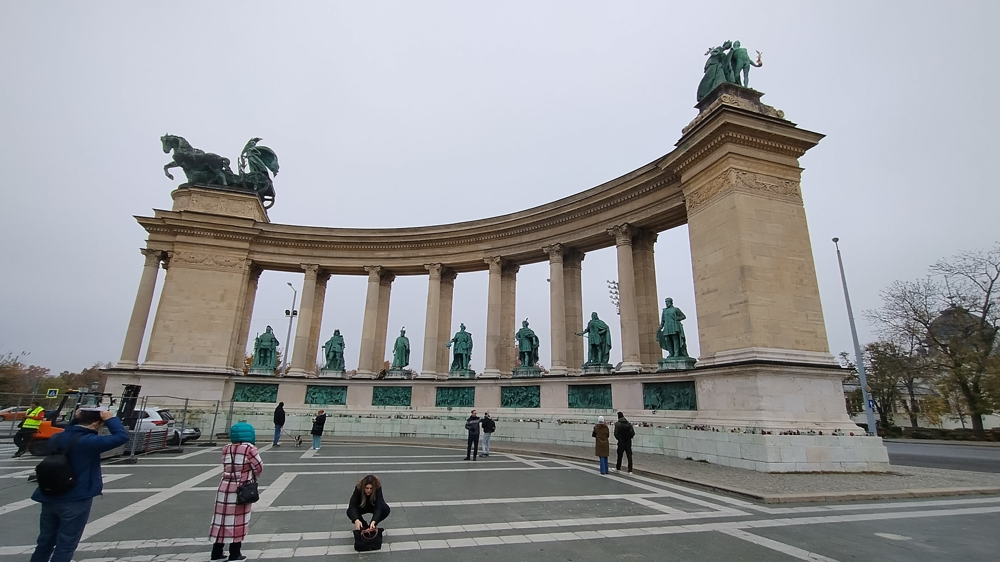

# Journeys of 2024

## Trip to Cardiff, Wales (June 25, 2024)

### Wales, June 25, 2024
A brief visit to Cardiff, Wales, where the vibrant city atmosphere was centered around a massive concert at Park Street. The location was alive with energy, communal celebration, and the spirit of live music, marking a lively yet fleeting experience amidst the bustling crowd.

  
The vibrant scene unfolds in Cardiff, where a massive crowd gathers for an electrifying concert on June 25, 2024. [View location on map](https://www.bing.com/maps?cp=51.47833333333333~-3.1824749999999997&lvl=16).

## Trip to Berlin, Germany (July 2 - 4, 2024)

### Germany, July 2 - 4, 2024
Exploring Berlin was a venturesome journey filled with iconic tastes and sights. Beginning with the delightful memory of Berlin's street food scene encapsulated in a currywurst dish with crispy fries, the trip continued with the grandeur of Berlin Hauptbahnhof and the historic essence of the city's monumental structures. The trip encapsulated the blend of Berlin's energetic lifestyle, architectural innovation, and rich history.

  
As I glanced at the photo, memories of wandering around Berlin flooded back, especially the taste of the iconic currywurst on July 2, 2024. [View location on map](https://www.bing.com/maps?cp=52.52441666666667~13.369544444444445&lvl=16).

  
The image captures the bustling entrance of the Berlin Hauptbahnhof on July 2, 2024. [View location on map](https://www.bing.com/maps?cp=52.52382222222222~13.369119444444445&lvl=16).

  
Standing at the heart of Berlin, I gazed up at the grandeur of the historic monument before me on July 4, 2024. [View location on map](https://www.bing.com/maps?cp=52.516416666666665~13.378411111111111&lvl=16).

## Trip to Tenby, Wales (August 5, 2024)

### Wales, August 5, 2024
Returning to Wales, the serene coastal town of Tenby offered a peaceful escape with its quiet beach scene. Here, the charming white house overlooking the sandy shore under an overcast sky created a cherished memory, capturing the tranquility and natural beauty of the Welsh coastline.

  
The tranquil beach scene in Tenby captures a serene moment by the coast on August 5, 2024. [View location on map](https://www.bing.com/maps?cp=51.67585833333333~-4.701925&lvl=16).

## Trip to Seattle and Surroundings, USA (September 15 - 20, 2024)

### USA, September 15 - 20, 2024
The American journey was an engaging blend of sports, architecture, and local culture across Seattle, Redmond, and Bellevue. Starting with the electric atmosphere of a baseball game in Seattle, the trip was punctuated by Redmond’s architectural charm and Bellevue’s relaxed ambiance. The culinary delights further enhanced the experience, especially in Seattle’s casual eateries, reinforcing the vibrant city exploration and the welcoming nature of the Pacific Northwest.

  
In Seattle, the vibrant energy of the baseball game filled the air on September 15, 2024. [View location on map](https://www.bing.com/maps?cp=47.59085~-122.33256944444445&lvl=16).

  
The image captures a modern outdoor architectural scene in Redmond on September 16, 2024. [View location on map](https://www.bing.com/maps?cp=47.643211111111114~-122.1336888888889&lvl=16).

  
This photo captures a vibrant scene in Bellevue, where the modern architecture of Bellevue Brewing Company stands prominently under a bright blue sky on September 18, 2024. [View location on map](https://www.bing.com/maps?cp=47.621375~-122.17839166666667&lvl=16).

  
In the heart of Seattle, I fondly remember this cozy moment indulging in a hearty breakfast on September 20, 2024. [View location on map](https://www.bing.com/maps?cp=47.61092777777778~-122.34072222222221&lvl=16).

## Trip to Santanyí and Felanitx, Spain (October 6, 2024)

### Spain, October 6, 2024
In Santanyí and nearby Felanitx, Spain, the days were filled with picturesque beaches and vibrant coastal scenes. The Mediterranean's turquoise waters were perfectly set against the rugged cliffs and lush greenery, offering a leisurely yet scenic respite. Visitors enjoyed the sunlit serenity and the cultural charm present in this stunning part of the world.

  
The image captures a lively beach scene in Santanyí on October 6, 2024. [View location on map](https://www.bing.com/maps?cp=39.376108333333335~3.2370583333333336&lvl=16).

  
The vibrant coastal scene in Felanitx is a captivating blend of turquoise waters and neatly arranged parasols on October 6, 2024. [View location on map](https://www.bing.com/maps?cp=39.379219444444445~3.2387333333333332&lvl=16).

## Trip to Bristol, England (October 18 - November 3, 2024)

### England, October 18, 2024
In Bristol, the trip began with a warm urban experience amidst bustling streets and nostalgic amusements. From lively street bars to retro game arcades, the city emanated a vibrant mix of history and modernity, embodying Bristol's unique urban charm.

  
This vibrant scene captures the lively atmosphere of a bustling street in Bristol on October 18, 2024. [View location on map](https://www.bing.com/maps?cp=51.45366111111112~-2.592530555555556&lvl=16).

  
In the heart of Bristol, the scene transports you to a nostalgic arcade filled with retro game machines on October 18, 2024. [View location on map](https://www.bing.com/maps?cp=51.45308888888889~-2.5959694444444446&lvl=16).

### England, November 3, 2024
The Bristol visit concluded with a captivating look into the past, as the steam locomotives amidst autumn foliage delivered a poignant journey into England’s rich travel history, contrasting beautifully with the city’s more modern attractions.

  
I remember my visit to Bristol, where I stumbled upon a scene that seemed to transport me back in time on November 3, 2024. [View location on map](https://www.bing.com/maps?cp=51.44443333333333~-2.466772222222222&lvl=16).

## Trip to Budapest, Hungary (November 10 - 12, 2024)

### Hungary, November 10 - 12, 2024
Budapest was a cultural and historic revelation, offering a rich tapestry of atmospheric bars, iconic architectural marvels like the Fisherman's Bastion, and panoramic river scenes starring the historic Buda Castle. This journey was one of discovering vibrant city life and breathtaking historical sights that resonate with the timeless allure of Hungary’s capital.

  
In Budapest, tucked away on Nagymező utca, I found myself in a cozy bar where the ambiance was warm and inviting on November 10, 2024. [View location on map](https://www.bing.com/maps?cp=47.50545~19.05752777777778&lvl=16).

  
On a visit to Budapest, you find yourself at the iconic Fisherman's Bastion on November 11, 2024. [View location on map](https://www.bing.com/maps?cp=47.50167777777778~19.034522222222225&lvl=16).

  
Standing by the river in Budapest, I am captivated by the breathtaking vista of the historic Buda Castle on November 11, 2024. [View location on map](https://www.bing.com/maps?cp=47.49808055555555~19.047069444444446&lvl=16).

  
In Budapest, the photograph captures a majestic monument featuring grand statues and towering columns on November 12, 2024. [View location on map](https://www.bing.com/maps?cp=47.51457777777778~19.076988888888888&lvl=16).